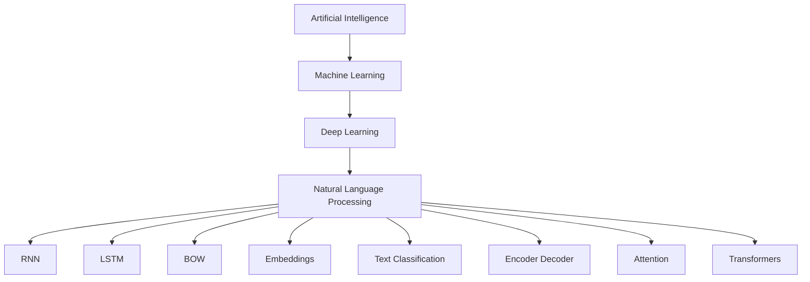

# Python Practice Notebooks

This folder contains my learning and practice notebooks in Python, Machine Learning, and NLP,.

## Files

1. Pandas_Series_and_DataFrame.ipynb
   - Includes Pandas Series, DataFrame operations, data preprocessing, and examples.
2. Neural_network.ipynb
   - Covers neural networks, encoder-decoder architecture, attention mechanism, and deep learning basics.
3. NLP.ipynb
   - Contains Natural Language Processing concepts and TensorFlow examples.

## Tools Used
- Python
- TensorFlow
- Pandas
- Google Colab
## Flow chart
## NLP Learning Flow

