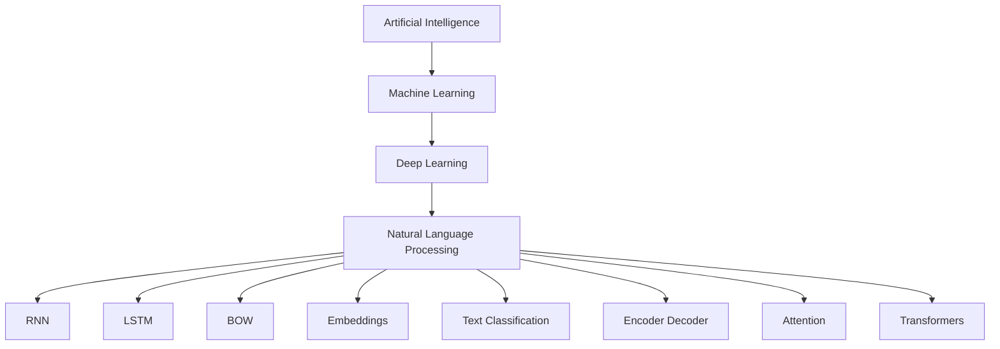

# Python Learning Repository

This repository contains my Python learning journey, including notes, practice programs, and concepts related to Python, Machine Learning, Deep Learning, and Natural Language Processing (NLP).

## Repository Structure

### 📁 Python Notes
Contains theory, explanations, and concept-based notebooks for learning Python and related technologies.

Topics include:
- Python Basics
- Pandas
- Neural Networks
- NLP Concepts
- TensorFlow Basics
- Deep Learning Fundamentals

### 📁 Python_Practice
Contains hands-on coding practice and implementation notebooks.

Practice areas:
- Data Structures in Python
- Pandas Series & DataFrames
- Neural Networks
- Text Classification
- Encoder-Decoder Architecture
- Attention Mechanism
- NLP Implementations

---

## Learning Flow

---

## Technologies Used
- Python
- Pandas
- TensorFlow
- NumPy
- Google Colab
- Machine Learning
- Deep Learning
- Natural Language Processing (NLP)

---

## Purpose
This repository is created to document my learning process, practice coding, and improve problem-solving skills in Python, Machine Learning, and NLP.
